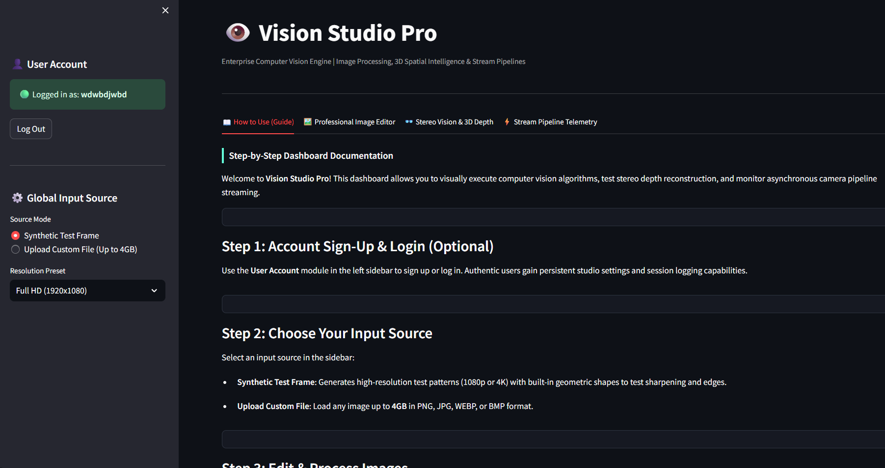
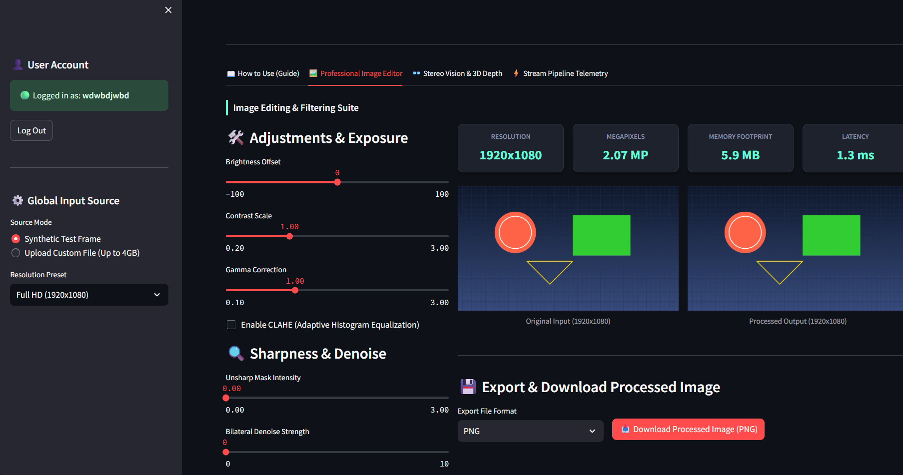
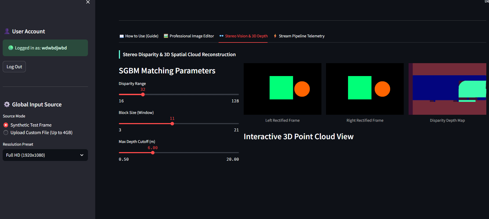
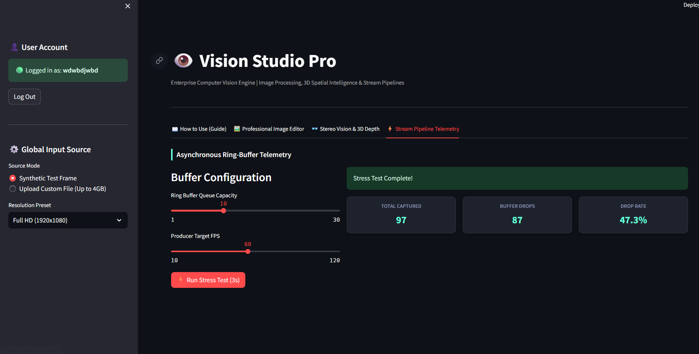

# 👁️ Vision Studio Pro

[](https://github.com/helloAi0/Camera-Image-Processor/blob/main/LICENSE)
[](https://opencv.org/)
[](https://helloai0-camera-image-processor-app-hilmvn.streamlit.app/)

**Vision Studio Pro** is an enterprise-grade Computer Vision engine and interactive spatial intelligence dashboard. Built for professionals, researchers, and engineers, this suite provides a unified interface for high-resolution image processing, stereo vision depth mapping, and asynchronous stream pipeline telemetry.

---

## 📖 Table of Contents
- [Overview](#-overview)
- [Key Features](#-key-features)
- [Gallery & Interface](#-gallery--interface)
- [Architecture & Workflow](#-architecture--workflow)
- [Tech Stack](#-tech-stack)
- [Getting Started](#-getting-started)
- [Usage Guide](#-usage-guide)
- [License](#-license)

---

## 🚀 Overview

Developing and testing computer vision pipelines traditionally requires writing extensive boilerplate code to visualize matrix operations, tune edge-detection thresholds, or map 3D point clouds. 

**Vision Studio Pro** solves this by abstracting the complexities of OpenCV into a sleek, dark-mode web application. It allows users to upload custom assets (up to 4GB) or use synthetically generated 4K test frames to instantly visualize algorithmic changes in real time. It features a robust multi-threaded architecture capable of simulating stress tests on ring-buffer pipelines.

---

## ✨ Key Features

1. **Professional Image Editor**: 
   - Non-destructive filtering including Unsharp Masking, Bilateral Denoising, and Gamma Correction.
   - Spatial transforms, CLAHE (Adaptive Histogram Equalization), and advanced edge operators (Canny, Sobel, Laplacian).
2. **Stereo Vision & 3D Spatial Cloud**: 
   - Interactive SGBM (Semi-Global Block Matching) tuning for disparity mapping.
   - Real-time 3D point cloud reprojection and interactive rotation via Plotly.
3. **High-Speed Pipeline Telemetry**: 
   - Simulates asynchronous producer-consumer camera streams.
   - Live metrics on memory footprint, execution latency (ms), buffer drop rates, and multi-threaded queue stability.
4. **Enterprise Export & Authentication**: 
   - Download processed matrices natively as compressed JPEG or lossless PNG.
   - Built-in session state authentication for user tracking and environment persistency.

---

## 🖼️ Gallery & Interface

### 1. User Guide & Authentication
A seamless onboarding experience with session-based authentication and a step-by-step interactive guide.


### 2. Professional Image Editor
Real-time telemetry (Megapixels, Memory, Latency) paired with high-fidelity algorithmic tuning.


### 3. Stereo Vision & 3D Depth
Configure baseline and focal length parameters to generate dense disparity maps and interactive 3D spatial clouds.


### 4. Stream Pipeline Telemetry
Stress-test multi-threaded ring buffers to analyze dropped frames and consumer/producer synchronization.


---

## 🧠 Architecture & Workflow

Vision Studio Pro is engineered using a scalable, object-oriented backend architecture coupled with a reactive frontend.

### The Pipeline Workflow
1. **Input Ingestion**: Images are loaded into memory either via a built-in synthetic 4K scene generator or a `multipart/form-data` file uploader. Matrices are immediately decoded into `numpy.ndarray` objects (RGB format).
2. **The Processor Engine**: Data is passed to the `BaseProcessor` (and its advanced child classes like `ProfessionalProcessor`). This engine applies spatial transformations, color space conversions, and morphological operations sequentially based on the UI state.
3. **Stereo Reconstruction**: For spatial intelligence, the `StereoVision` class computes disparity using OpenCV's `StereoSGBM`. The resulting depth map is multiplied against a generated $Q$ (Reprojection) matrix to plot $X, Y, Z$ coordinates in a 3D scatter graph.
4. **Asynchronous Streaming**: The `StreamPipeline` utilizes Python's `threading` and `queue` modules to simulate a real-time hardware camera stream, calculating queue overflow and buffer degradation under stress.

---

## 🛠️ Tech Stack

* **Frontend / UI**: [Streamlit](https://streamlit.io/) (with custom CSS for dark aesthetic)
* **Core Vision Engine**: [OpenCV (cv2)](https://opencv.org/)
* **Matrix Operations**: [NumPy](https://numpy.org/)
* **3D Visualization**: [Plotly Graph Objects](https://plotly.com/python/)
* **Concurrency**: Python native `threading` & `queue`

---

## 💻 Getting Started

### Prerequisites
* Python 3.9 or higher
* Git

### Installation

1. **Clone the repository:**
   ```bash
   git clone [https://github.com/YOUR_USERNAME/Camera-Image-Processor.git](https://github.com/YOUR_USERNAME/Camera-Image-Processor.git)
   cd Camera-Image-Processor